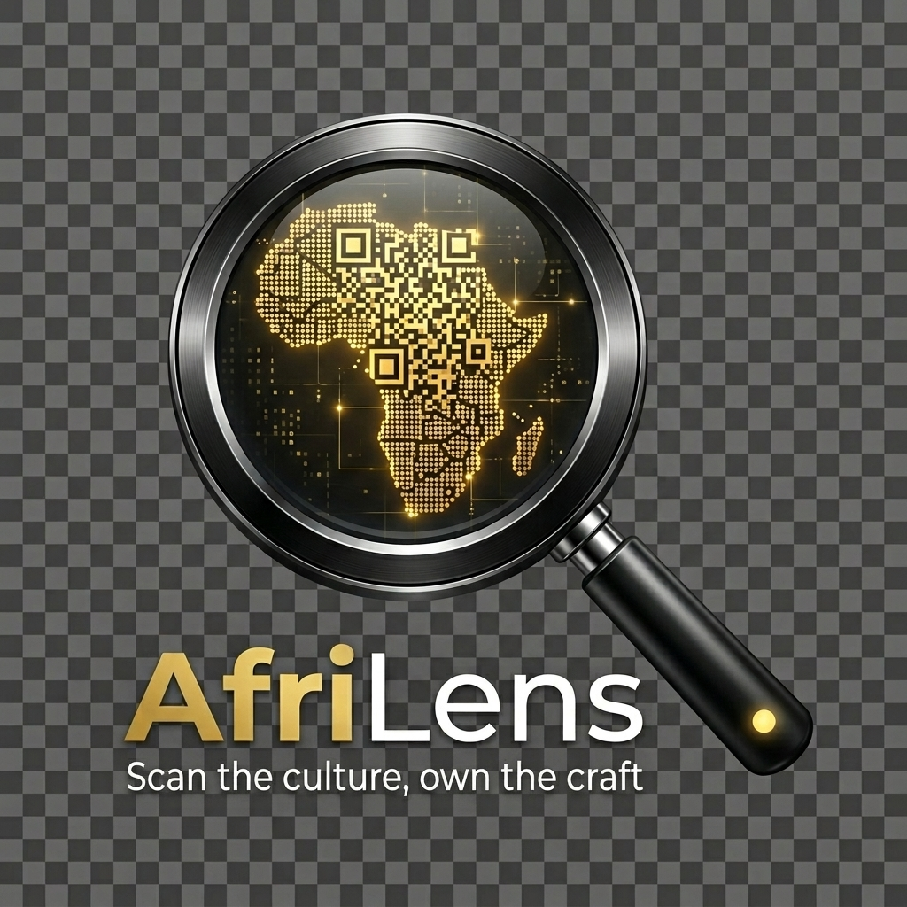

<p align="center">
  
</p>

<h1 align="center">AfriLens — Landing Page</h1>

<p align="center">
  <strong>Scan the culture. Own the craft.</strong><br/>
  The official promotional landing page for the AfriLens mobile application.
</p>

<p align="center">
  <a href="https://github.com/mosisafeyissa/Kuriftu-AI-Cultural-Exploration-Platform">📱 Mobile App Repo</a> •
  <a href="#-getting-started">🚀 Getting Started</a> •
  <a href="#-project-structure">📂 Structure</a> •
  <a href="#-tech-stack">🛠 Tech Stack</a>
</p>

---

## 📖 About

**AfriLens** is an AI-powered cultural exploration and artisan commerce platform built for **Kuriftu African Village**. It transforms a passive hotel stay into an interactive, zero-inventory revenue engine — guests scan physical artifacts with their phone camera, receive rich AI-generated cultural narratives, and purchase authentic artisan replicas directly from their villa.

This repository contains the **landing page / marketing website** that showcases the AfriLens project. It serves as the public-facing entry point for judges, investors, and potential users.

> **💡 Looking for the full-stack mobile application?**  
> The Flutter + Django backend lives here → [Kuriftu-AI-Cultural-Exploration-Platform](https://github.com/mosisafeyissa/Kuriftu-AI-Cultural-Exploration-Platform)

---

## ✨ Landing Page Features

### 🎬 Hero Section
- Full-screen cinematic hero with background imagery and floating particle accents
- **Embedded demo video player** with custom controls (play/pause, seekbar, volume, fullscreen)
- Direct **APK download** button and link to the GitHub source code

### 🔲 QR Room Tour
- Three scannable **QR codes** (Villa 1, Villa 2, Villa 3) displayed side-by-side
- Each QR code links to a unique in-app room tour experience
- Descriptive block explaining the **"Scan → Story → Buy"** core loop — how guests unlock an immersive digital tour by scanning a wooden QR block on their nightstand

### 🏆 Why It Wins
- Three-column feature grid showcasing the core experience:
  - **Discover** — AI Image Recognition (point, scan, identify)
  - **Learn** — Dynamic Cultural Storytelling (AI-generated narratives)
  - **Earn** — Zero-Inventory E-Commerce (direct artisan purchases)

### 🏗 Architecture Stack
- Visual tech stack flow showing the production-grade pipeline:
  - **Flutter** → Mobile App
  - **Django REST** → Backend Engine
  - **SimpleJWT** → Authentication
  - **AI / LLM** → Vision + Language (Google Gemini)

### 🎨 Design System
- Premium dark-themed aesthetic inspired by African cultural heritage
- Custom color palette: Terracotta, Gold, Earth, and Warm White tones
- Glassmorphism cards with hover animations and gradient accents
- Fully responsive — optimized for desktop, tablet, and mobile
- Smooth scroll behavior with micro-animations throughout

---

## 🛠 Tech Stack

| Technology | Purpose |
|---|---|
| **Next.js 16** | React framework with App Router |
| **React 19** | UI component library |
| **TypeScript** | Type-safe development |
| **Tailwind CSS 4** | Utility-first styling |
| **Lucide React** | Icon library |
| **Geist Font** | Typography (Sans + Mono) |

---

## 📂 Project Structure

```
afrilens/
├── app/
│   ├── layout.tsx          # Root layout with metadata & fonts
│   ├── page.tsx            # Single-page landing (all sections)
│   ├── globals.css         # Design tokens, animations, utilities
│   └── favicon.ico         # Site favicon
├── public/
│   ├── logo.png            # AfriLens app logo
│   ├── hero-bg.jpg         # Hero section background image
│   ├── afrilens.mp4        # Demo video
│   ├── app-release.apk     # Android MVP download
│   ├── qr-room-1.jpg       # QR code — Villa 1
│   ├── qr-room-2.jpg       # QR code — Villa 2
│   └── qr-room-3.jpg       # QR code — Villa 3
├── package.json
├── tsconfig.json
├── next.config.ts
├── postcss.config.mjs
└── eslint.config.mjs
```

---

## 🚀 Getting Started

### Prerequisites

- **Node.js** 18+ installed
- **npm** (comes with Node.js)

### Installation

```bash
# 1. Clone the repository
git clone https://github.com/Annabdiyu/AfriLens-web-.git
cd AfriLens-web-

# 2. Install dependencies
npm install

# 3. Start the development server
npm run dev
```

Open [http://localhost:3000](http://localhost:3000) in your browser to view the site.

### Build for Production

```bash
# Create an optimized production build
npm run build

# Serve the production build
npm start
```

---

## 🔗 Related Repositories

| Repository | Description |
|---|---|
| [Kuriftu-AI-Cultural-Exploration-Platform](https://github.com/mosisafeyissa/Kuriftu-AI-Cultural-Exploration-Platform) | Full-stack application — Flutter mobile app, Django REST backend, AI/LLM integration, Chapa payments, Cloudinary media |
| [AfriLens-web](https://github.com/Annabdiyu/AfriLens-web) | This repository — Landing page & marketing website |

---

## 🧭 How AfriLens Works

```
┌──────────────┐     ┌──────────────┐     ┌──────────────┐
│              │     │              │     │              │
│   DISCOVER   │────▶│    LEARN     │────▶│     EARN     │
│              │     │              │     │              │
│  Scan any    │     │  AI reveals  │     │  Buy the     │
│  artifact    │     │  the story   │     │  craft       │
│              │     │              │     │              │
└──────────────┘     └──────────────┘     └──────────────┘
    Flutter              Gemini AI            Chapa Pay
  Camera Scan        Cultural Narrative    Zero-Inventory
```

1. **Scan** — Guest points their phone at any artifact, textile, or art piece in their Kuriftu villa
2. **Story** — AI instantly generates a rich cultural narrative — origin, artisan lineage, materials, and symbolism
3. **Buy** — Guest purchases an authentic replica shipped direct from local artisans — no warehouse, no middlemen

---

## 🎯 The QR Room Tour Experience

The QR Room Tour serves as the frictionless front door to the AfriLens experience, transforming a static hotel stay into an interactive digital museum the second a guest arrives. By opening the AfriLens app and scanning a beautifully crafted wooden QR block on their nightstand, guests unlock an immersive digital room tour.

Acting as a personal concierge, the app provides a brief, captivating description of the specific history and rich culture behind their villa's design. This guided experience organically gamifies the physical space, highlighting the unique artifacts around them and seamlessly driving guests toward high-margin e-commerce purchases before they even unpack.

> **Core Loop: Scan → Story → Buy**

---

## 🏗 Full System Architecture

```
┌─────────────────────────────────────────────────────┐
│                   MOBILE CLIENT                      │
│               Flutter (Dart) + Camera                │
└──────────────────────┬──────────────────────────────┘
                       │ REST API (HTTPS)
                       ▼
┌─────────────────────────────────────────────────────┐
│                  BACKEND SERVER                      │
│            Django REST Framework (Python)             │
│         ┌─────────┬──────────┬──────────┐           │
│         │ Auth    │ Artifacts│  Orders  │           │
│         │(JWT)    │  CRUD    │  + Pay   │           │
│         └────┬────┴─────┬────┴─────┬────┘           │
└──────────────┼──────────┼──────────┼────────────────┘
               │          │          │
        ┌──────▼──┐  ┌────▼────┐  ┌──▼──────┐
        │PostgreSQL│  │Cloudinary│  │ Chapa   │
        │  (DB)   │  │ (Media) │  │(Payments)│
        └─────────┘  └─────────┘  └─────────┘
               │
        ┌──────▼──────┐
        │ Google Gemini│
        │  Vision API  │
        │  (AI / LLM)  │
        └──────────────┘
```


<p align="center">
  <sub>Hospitality Hackathon 2026</sub>
</p>
